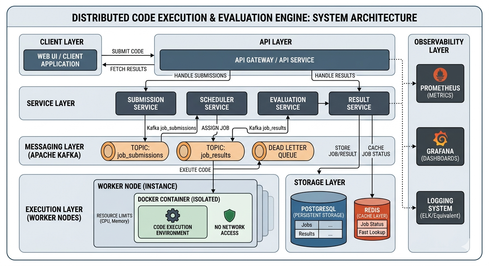

# 🚀 Distributed Code Execution & Evaluation Engine

A production-grade, highly scalable, and secure distributed system designed to execute and evaluate untrusted code across multiple languages. Built with a microservices architecture to handle high-concurrency competitive programming and technical assessment workloads.

---

## 🏗️ System Architecture



The engine follows a **decoupled, event-driven microservices architecture** using **Apache Kafka** as the central message backbone.

### 🧩 Core Services
1.  **API Gateway (Node.js/Express)**: Entry point for job submissions. Features AI-powered security scanning and Redis-backed rate limiting.
2.  **Scheduler Service (Node.js)**: Orchestrates job distribution across the worker pool using intelligent round-robin dispatching.
3.  **Worker Service (C++)**: High-performance execution engine. Uses **Docker sandboxing** and `ulimit` constraints to run untrusted code safely.
4.  **Evaluation Service (Node.js)**: Decoupled logic for comparing execution output against expected results (AC, WA, TLE, RTE, CE).
5.  **Result Service (Node.js)**: Manages persistence of results in **PostgreSQL** and provides sub-millisecond status lookups via **Redis**.
6.  **Scaling Service (Node.js)**: Monitors Kafka consumer lag and provides auto-scaling recommendations for the worker pool.

---

## 🛠️ Technology Stack

-   **Backend**: Node.js (TypeScript), C++ (httplib, nlohmann-json)
-   **Frontend**: Next.js 15, React, Tailwind CSS, Monaco Editor
-   **Messaging**: Apache Kafka
-   **Persistence**: PostgreSQL (Results), Redis (Caching & Rate Limiting)
-   **Observability**: Prometheus (Metrics), Winston (Logging)
-   **Infrastructure**: Docker, Docker Compose, Kubernetes (Helm Charts)
-   **CI/CD**: GitHub Actions

---

## 🛡️ Security & Isolation

-   **Docker Sandboxing**: Every job runs in an isolated, short-lived container.
-   **Resource Constraints**: Strict limits on CPU time, memory (RSS), and file size via `ulimit`.
-   **AI Security Scanner**: Pre-execution analysis to reject malicious code patterns before they enter the system.
-   **Zero Trust**: Workers are completely isolated from databases and internal state; they only communicate via the Scheduler and Kafka.

---

## 🚀 Quick Start (Local)

### Prerequisites
- Docker & Docker Compose
- Node.js 18+

### 1. Clone & Setup
```bash
git clone https://github.com/AnilMarneni/Distributed-Code-Execution-Engine.git
cd Distributed-Code-Execution-Engine
```

### 2. Start Infrastructure
```bash
docker-compose up -d
```

### 3. Start Services
Each service can be started independently:
```bash
# Example for API Service
cd api-service
npm install
npm run dev
```

### 4. Interactive Documentation
Once started, visit `http://localhost:3000/api-docs` to explore the API via Swagger.

---

## 📈 Monitoring & Metrics

-   **Prometheus**: All Node.js services and C++ workers expose `/metrics`.
-   **Dashboards**: Use the provided Grafana configurations (in Phase 5) to visualize throughput and latency.

---

## 🗺️ Project Roadmap

-  **Phase 1**: Core Execution Pipeline
-  **Phase 2**: Robustness & Hardening
-  **Phase 3**: Persistence Layer
-  **Phase 4**: Frontend Dashboard
-  **Phase 5**: Production Hardening & Observability
-  **Phase 6**: AI Security & Intelligent Scaling
-  **Phase 7**: Resilience & Developer Experience
-  **Phase 8**: Final Readiness & Documentation

---

## 📄 License
MIT License - Developed by **Anil Marneni**.
