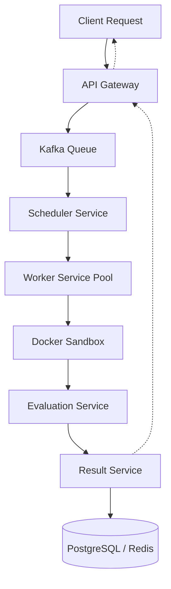

# 🛠️ Distributed C++ Code Execution Engine

A polished, educational exploration of distributed systems, focused on safe, isolated execution of C++ code using Docker sandboxing and Kafka-backed communication.

This project is built to demonstrate core infrastructure engineering concepts: asynchronous task processing, microservices orchestration, and resource-constrained execution environments.

---

## 🏗️ System Architecture

The engine follows a decoupled, event-driven pipeline where each service handles a specific stage of the execution lifecycle.



### 🧩 Core Services
1.  **API Gateway (Node.js)**: Entry point for C++ submissions. Handles input validation, job ID generation, and real-time status streaming via WebSockets.
2.  **Scheduler Service (Node.js)**: Consumes jobs from Kafka and assigns them to available workers using a round-robin strategy with circuit breakers.
3.  **Worker Service (C++)**: The technical heart of the system. Manages the lifecycle of code compilation (g++) and execution within ephemeral, isolated Docker containers.
4.  **Evaluation Service (Node.js)**: Compares execution output against expected results to determine verdicts (AC, WA, TLE, etc.).
5.  **Result Service (Node.js)**: Persists execution metadata and logs in PostgreSQL for historical tracking and Redis for fast status lookups.

---

## 🚀 Key Technical Features

*   **Isolated Execution**: Code runs inside ephemeral Docker containers with strict CPU/Memory limits and no network access.
*   **Asynchronous Pipeline**: Job submissions are non-blocking. The frontend monitors progress in real-time via WebSockets.
*   **C++ Specialized**: Deep focus on g++ compilation logs, runtime statistics, and safe memory management.
*   **Infrastructure UX**: A premium, "cozy nerdy" dashboard designed for infrastructure visibility and system monitoring.
*   **Observability**: Lightweight metrics tracking queue depth, worker activity, and execution latency.

---

## 🛠️ Quick Start (Local Development)

### 1. Spin up Infrastructure
```powershell
docker-compose up -d
```

### 2. Start Services
Each service can be started in its own terminal:

```powershell
# API Gateway (Port 3000)
cd api-gateway && npm run dev

# Scheduler
cd scheduler-service && npm run dev

# Worker (C++ Implementation)
cd worker-service && ./worker.exe

# Evaluation & Result Services
cd evaluation-service && npm run dev
cd result-service && npm run dev
```

### 3. Launch Dashboard
```powershell
cd frontend && npm run dev
```
Visit **`http://localhost:3000`** to view the execution engine.

---

## 🎓 Educational Goals
This project was built to explore:
*   How to build reliable asynchronous systems using **Kafka**.
*   The trade-offs of **Docker-based sandboxing** for untrusted code.
*   State management in **distributed microservices**.
*   Real-time system observability and **WebSocket-based telemetry**.
